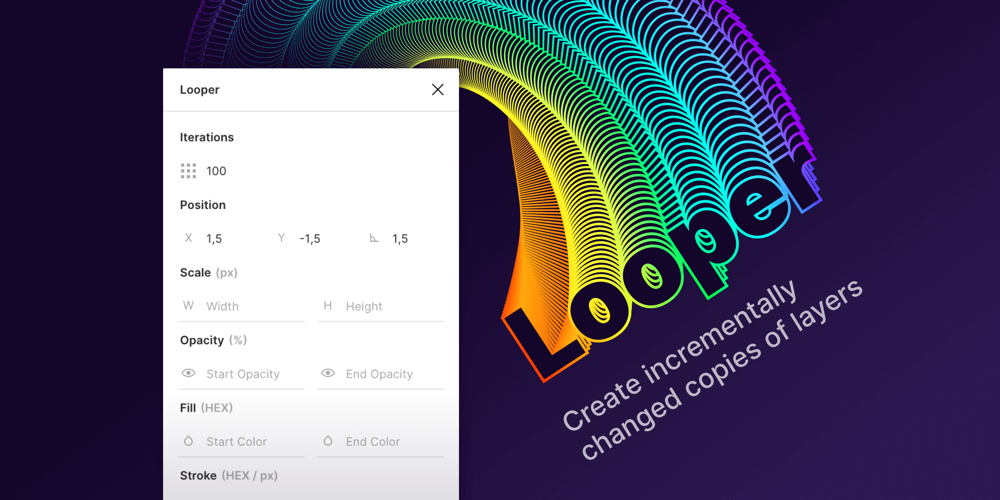

# Looper

A Figma plugin for creating trippy generated graphics. Works with any Vector, Shape or Text layer.

## Installation
1. Clone the repository: `git clone https://github.com/kuldar/figma-looper.git`
2. Navigate to the folder `cd figma-looper`
3. Install dependencies `npm install`
4. Build the plugin `npm run build`
5. Go a new document in Figma and select `Plugins -> Development -> New Plugin` from the menu
6. Click on "Link existing plugin" and select the `/figma-looper/manifest.json` file

## Usage
1. Select a Vector, Shape or Text layer
2. Run the plugin
3. Set iteration count
4. Set X, Y and rotation increments
5. Optionally set start and end values for opacity, fill- and stroke colors and stroke sizes

## Examples

### Move X
Iterations: 10, X: 5, Opacity: 100 to 100

### Move Y
Iterations: 25, Y: 5, Opacity: 100 to 100

### Move X/Y + Opacity
Iterations: 25, X: 5, Y: 5, Opacity: 100 to 0

### Rotate + Opacity
Iterations: 100, Rotate: 5, Opacity: 100 to 0

### Rotate + Scale + Move X + Opacity (100 to 0)
Iterations: 25, Rotate: 5, X: 5, Scale W: 5, Scale H: 5, Opacity: 100 to 0

### Rotate + Scale + Move Y + Opacity (100 to 0)
Iterations: 100, Rotate: 5, Y: 20, Scale W: 5, Scale H: 5, Opacity: 100 to 0
